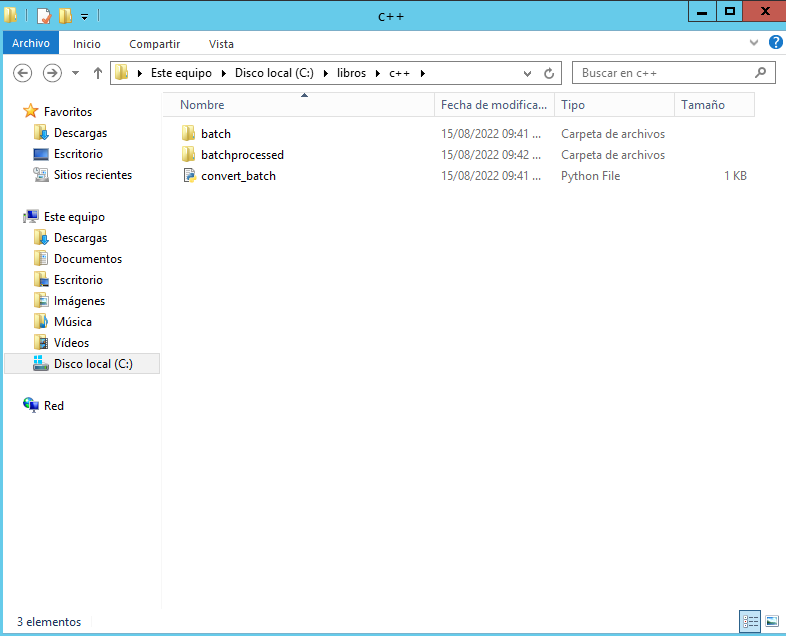

<h1>ImageBatchProcessor</h1>

Programa en python que usa la biblioteca Pil para hacer un mismo cambio a varias imágenes en una carpeta designada.

Por ahora hay que tener el archivo .py, una carpeta llamada batch que contenga las imagenes a editar y otra llamada batchprocessed vacía para ejecutar el programa.

Trabajando en una interfaz que permita ingresar por línea de comandos la ubicación de la carpeta de origen y destino. En un futuro también espero incluir una interfaz gráfica con Qt.

